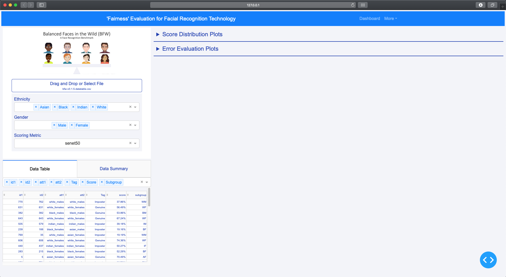

***INSERT GRAPHIC HERE (include hyperlink in image)***

# Balanced Faces in the Wild Dashboard


> The BFW Dashboard is designed for users to quickly discover and analyze the bias, if any, in their facial recognition models.

[](https://travis-ci.org/badges/badgerbadgerbadger)      [](https://rubygems.org/gems/badgerbadgerbadger) 
[](http://badges.mit-license.org) 





> GIF Tools

- Use <a href="http://recordit.co/" target="_blank">**Recordit**</a> to create quicks screencasts of your desktop and export them as `GIF`s.
- For terminal sessions, there's <a href="https://github.com/chjj/ttystudio" target="_blank">**ttystudio**</a> which also supports exporting `GIF`s.

**Recordit**


---

## Table of Contents (Optional)

> If your `README` has a lot of info, section headers might be nice.

- [Installation](#installation)
- [Features](#features)
- [Contributing](#contributing)
- [Team](#team)
- [License](#license)

---

## Installation
Clone this repository:
```bash
git clone https://github.com/ddasgupta4/bfw-dash.git
```

Download requirements:
```bash
pip install requirements.txt
```


## Usage
To run the dashboard navigate to the directory and execute the following command:

```bash
python app.py
```

---


## Documentation
- The research paper supporting this dashboard can be found <a href="assets/A Fairness Tool for Bias in FR Updated.pdf">here</a>.
- This dashboard was presented at Northeastern University's RISE 2020.
    - The poster presented can be found <a href="assets/RISE Poster.pdf">here</a>.
    - A recording of our presentation can be found <a href="https://web.microsoftstream.com/video/849f7262-b45e-41d7-9dd4-91a02dfe18cd" target="_blank">here</a>. 
- Going into more detail on code and technologies used
- This dashboard was produced as an extension of the work shared at https://github.com/visionjo/facerec-bias-bfw

---


## License

[](http://badges.mit-license.org)

- **[MIT license](http://opensource.org/licenses/mit-license.php)**

## TODO

Dylan
- [x] Fix layout to emphasize graphs
- [x] Move data table section to take up less space
- [x] Fix callback error
- [x] Configure global filters for data
    - Add more filters (age, subgroup, etc.)
    - Fix filter style
- [x] Make all tabs/callbacks trigger after upload data
    - Right now uploading new data works, but the datatable/graphs don't update unless they're clicked
- [x] Add instructions, github, report to "more" in header
- [ ] Add warning/error message when data is invalid
- [ ] Add more styling to CSS to avoid inline styling in app.py
    - Reduce clutter and increase readability
    
William & Alice
- [ ] Create more visualizations
    - ROC Curve
    - Summary table
    - Confusion Matrix
    - DET Curves 
    - SDM
