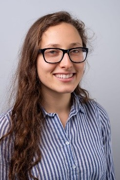
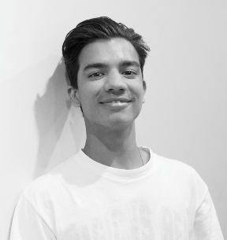
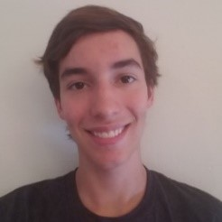

Rohan Krishnamurthi is an industrial engineering student at Northeastern University (NEU) in Boston, MA, class of 2022, with minors
in computational data analytics and Mathematics. Graduate of Saint John’s High School (2014-2018) with honors including AP scholar, 
National Honors Society, High Honor Roll, and varsity athlete. Former occupations include a teacher for Kumon of America (2014-2018), 
quality assurance at BL Healthcare (2018), and a basketball coach for the town of Ashland (2015-2017). His recent projects completed 
are Optimization of Medical System’s Transportation Methods (2019) and UniqueShoes Store and Database Design (2019). He plays the 
guitar at Northeastern and is involved in the Institute of Industrial Engineers (IISE), the Actuarial Club, and the South Asian Society 
of Engineers(SASE). He has tutored students at all levels including Calculus, Geometry, and Chemistry throughout high school and basic
Mathematics and English to elementary students in London, UK. 

Alice Loukianova was born on October 23, 1998 in Teaneck, NJ.  Alice Loukianova is currently an undergraduate student at Northeastern University (NEU) set to receive a B.S. in mechanical engineering in Spring 2021. She has been a research assistant in the Lab for Neuromodulation and Neuromuscular Repair (2016-2017) as well as the Occupational Biomechanics and Ergonomics Lab (2017-2018), a joint lab between MIT and NEU. At NEU she has held many leadership positions serving as Design Lead for a project in Enabling Engineering, President of the Biomedical Engineering Society, Lab Safety Technician for Aerospace NU, VP for Advocacy for the Resident Student Association, Outreach Coordinator for Academic Enrichment for Student Government, Leadership Associate for the Center for Student Involvement, and Service Learning Mentor for the GE1501/1502 classes. This year her leadership positions include being the Build Studio Hardware Engineer in the Generate Product Development Studio at NEU, as well as being VP for Recognition in NEU’s National Residence Hall Honorary chapter. She has also completed two co-ops at Nova Biomedical (2018) and at Desktop Metal (2019), she currently works as a Machine Shop Assistant in the Mechanical and Industrial Engineering Machine Shop at NEU in Boston, MA. Ms. Loukianova is a member of The American Society of Mechanical Engineers (ASME) as well as The Society of Women Engineers (SWE). 

Dylan Dasgupta is a student at Northeastern University on track to receive a BS in Industrial Engineering and a minor in Data Science in December of 2020. His past co-ops were at Liberty Mutual Insurance as a Continuous Improvement Analyst (Boston, 2018) and Rue Gilt Groupe as an Advanced Analyst (Boston, 2019). Former leadership positions include Vice President of External Affairs for the Northeastern Interfraternity Council (2018-2019). Some of his past work can be found on GitHub at github.com/ddasgupta4

William R. Cutler is an undergraduate Computer Science/Physics student at Northeastern University (NEU) in Boston, MA, Class of 2023. He currently works as a Teaching Assistant for the Khoury Colleges of Computer Science at NEU, assisting with the Fundamentals of Computer Science course (Jan. 2020). Previous teaching assistant positions include TA for Agoura High School’s advanced physics course (2018-2019), and Tutor at the Kumon Math and Reading Center in Agoura Hills, CA (2017 – 2018). He has also worked as a Research Assistant for the Zhang Computational Materials Science lab in at California State University, Northridge in the field of electrocatalysis, studying reactions that occur in hydrogen fuel cells. He has held multiple leadership positions including President of the Math Honor Society, co-founder and VP of History Honor Society, and attorney co-captain of Mock Trial team. Through classes, clubs, and on his own, he has completed many software projects, including a recreation of the classic game “Centipede”, code to handle wireless data transfer from remote control to robotic vehicle, a simulation experiment to study the game theory of the ultimatum game, and two applications published in the Google Play store: a puzzle game and a productivity tracker. He is an avid clarinetist, performing for NEU’s Wind Ensemble and Symphony Orchestra, and also an Eagle Scout. 

